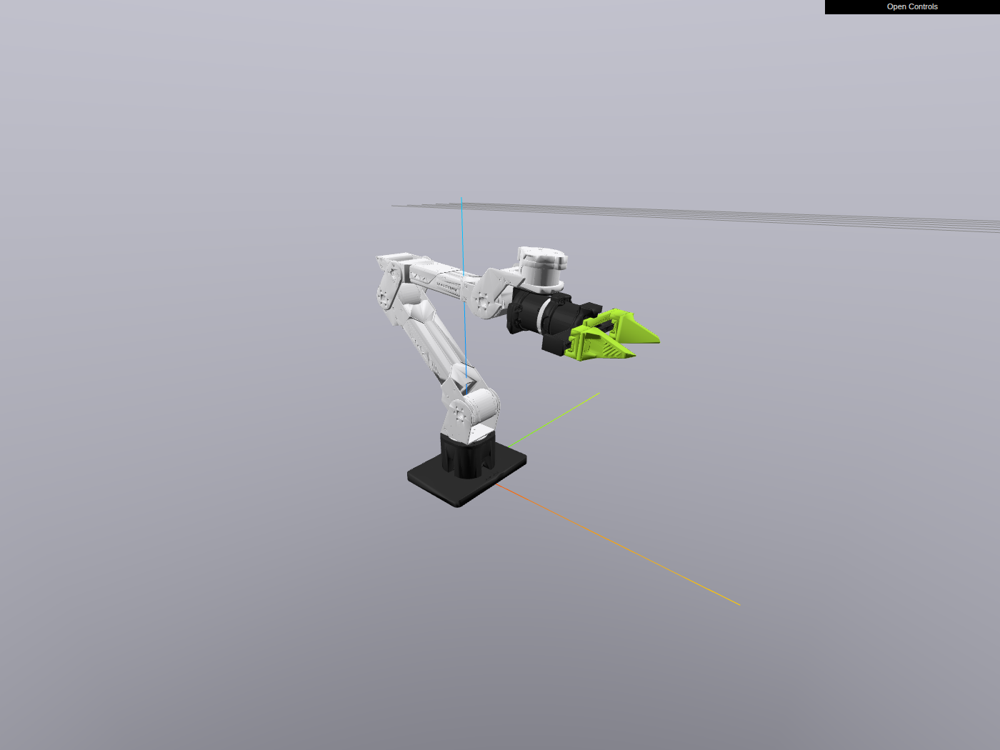
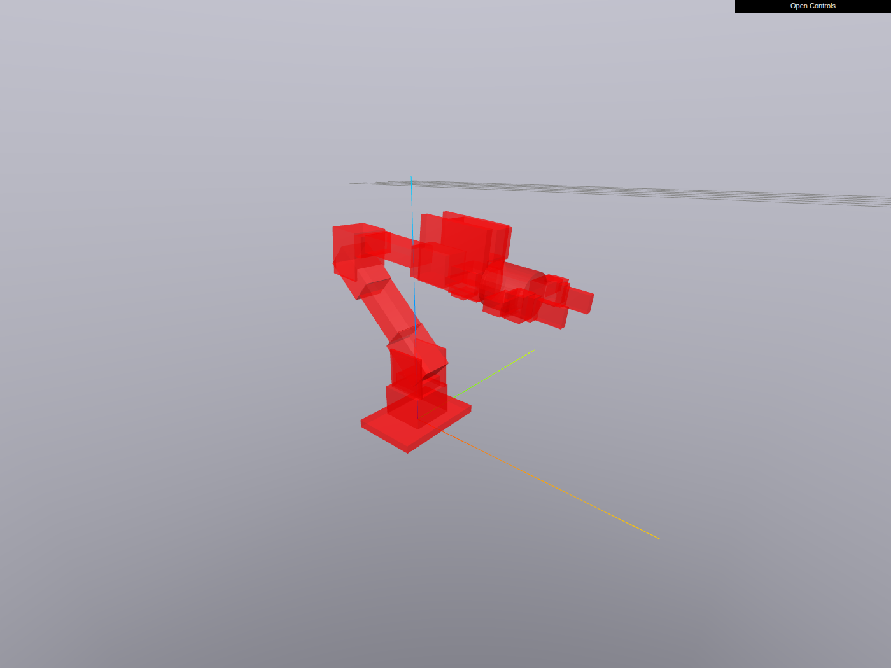
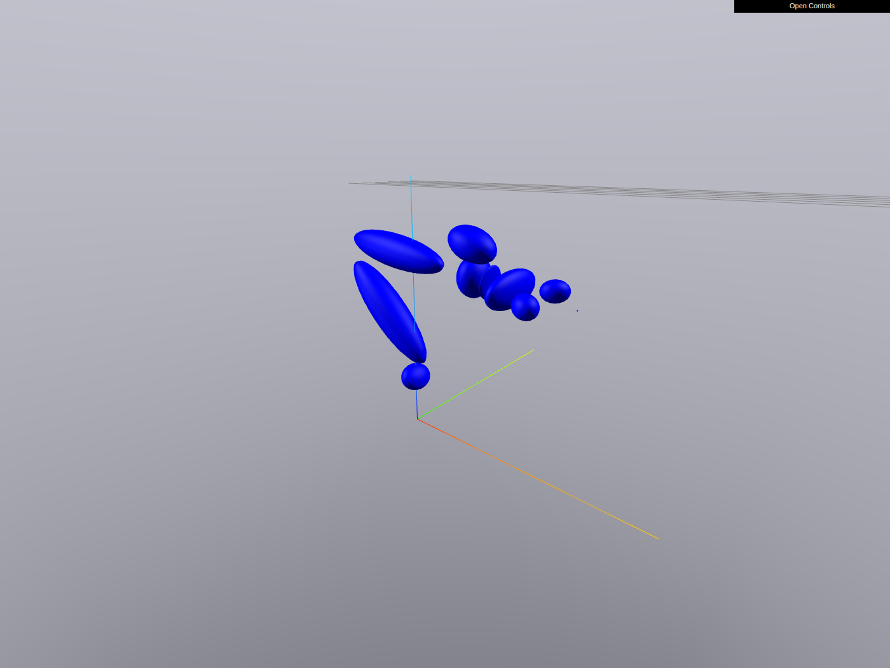
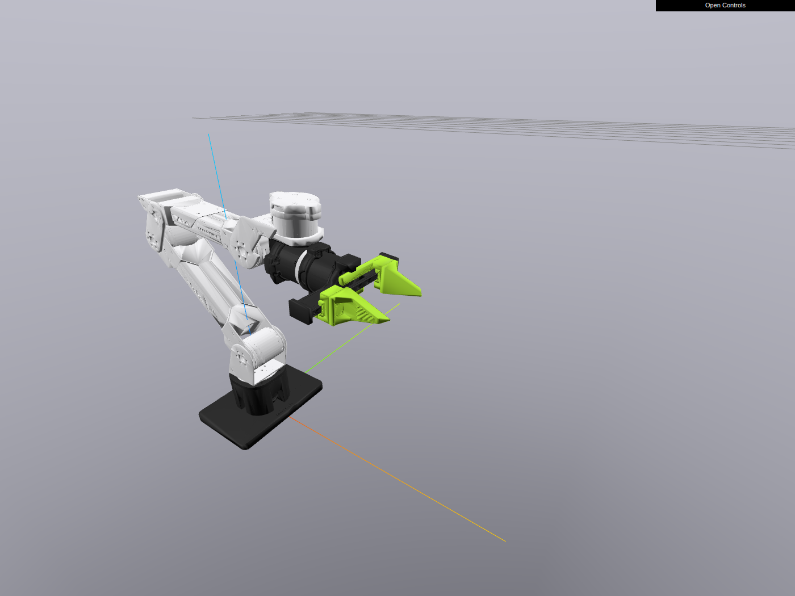

# reBot B601 DM Description

## Overview

This directory contains URDF descriptions of Seeed Studio's reBot Arm B601 DM: a 6-DOF arm built around
Damiao (DM) motors with an actuated parallel gripper. The original description files can be found in the
[reBotArmController_ROS2](https://github.com/Seeed-Projects/reBotArmController_ROS2) repository
(`src/rebotarm_bringup/description/`), which is part of the wider
[reBot-DevArm](https://github.com/Seeed-Projects/reBot-DevArm) project.

The arm ships in a single configuration, so there is one model file per flavor:

* `urdf/rebot_b601_dm_with_gripper.urdf` — the full arm with the actuated parallel gripper, usable in a
regular ROS setting (although it's not something I've really tested).
* `drake_urdf/rebot_b601_dm_with_gripper.urdf` — the version of the model modified for use with Drake, with
Drake specific extension tags added to it.

## Additional modifications

The original SolidWorks-exported URDF references dense STL meshes for both visual and collision geometry.
The following changes were made:

* Visual meshes were converted from STL to OBJ and decimated to at most 20k faces per link (quadric edge
collapse via meshlab). Original STLs are kept next to the OBJs under `meshes/*/visual/`.
* Collision geometry was replaced with tight convex primitives (boxes and cylinders) fitted per link. The
fit minimizes total primitive volume subject to fully enclosing the link surface, so the primitives hug the
geometry without the cost of dense trimesh collision. They are stored as convex OBJ meshes under
`meshes/*/collision/<link>/` and declared with `drake:declare_convex` in the Drake model. Unlike the lite6
package there are no separate "original" collision meshes; the originals are identical to the visual STLs.
* Kinematics, joint limits, inertials and joint ordering are preserved verbatim from the manufacturer URDF.
Note that the manufacturer's velocity limits (50 rad/s on joints 1-3, 200 rad/s on joints 4-6) look like
motor no-load figures rather than usable arm-level limits; the vendor MoveIt configs plan with 1.0 rad/s.
* A TCP frame (`link_eef_tip`) was added for FK / IK. The gripper fingertips meet exactly on the link6 z
axis at z = 0.15971 when closed, so the tip frame sits there with the same orientation as link6.
* The two gripper fingers physically touch at the closed state (q = 0), so a Drake collision filter group
excludes finger-to-finger collision; grasped objects still collide with each finger.
* The link6 flange is permanently nested inside the link4 wrist bracket (their collision envelopes overlap
at every configuration), so that pair is filtered like an adjacent pair. Note that in the all-zero folded
pose the primitives of some non-adjacent links (link1/link2 against link4/link5) interpenetrate by a few
millimetres; those pairs are deliberately NOT filtered since elbow-on-arm collision matters in operation.
* Transmissions were added per actuated joint. Joints 1-3 are DM-J4340 motors (40:1), joints 4-6 are
DM-J4310 motors (10:1), encoded as `drake:gear_ratio` on the actuators in the Drake model.
* Named materials approximating the product colors (black motor housings, silver structural links, green
gripper fingers).

## Gripper

The gripper has two prismatic finger joints, each travelling 0 to 0.0715 m outward from the closed state.
The fingertips touch at q = (0, 0), so the physical jaw opening width is simply the sum of the two joint
positions (maximum 0.143 m at the tips). On hardware both fingers are driven by a single DM motor; the
vendor stack maps motor position 0 (closed) to -5 rad (open).

## Zero configuration

The all-zero joint configuration is the vendor home pose: shoulder and forearm horizontal, gripper pointing
forward, everything parallel to the ground. Joints 2 and 3 sit exactly at their upper limit (0.0) in this
configuration.

## Visuals

### Visual model

### Collision geometry

### Inertia representations

### Gripper

